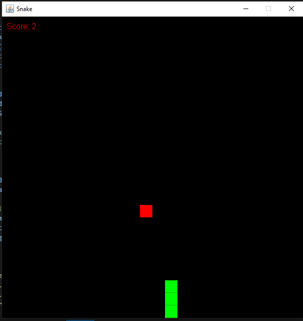

# SnakeGame in Java

Welcome to the SnakeGame! This project is a classic implementation of the Snake game, developed in Java. Guide the snake to eat food, grow in length, and avoid crashing into the walls or itself.

## Features

- **Classic Gameplay**: Experience the traditional Snake game mechanics where the snake grows as it eats food.
- **Score Tracking**: Keep track of your score as you play.
- **Built-In Libraries**: Developed using Java's built-in libraries for efficient and straightforward gameplay.

## How to Play

1. **Clone the Repository**:
    ```bash
    git clone https://github.com/shakal19/SnakeGame.git
    cd SnakeGame
    ```

2. **Compile the Game**:
    ```compile it in any editor that
     supports Java
    ```


4. **Game Controls**:
   - Use the arrow keys to control the snake's direction.
   - The objective is to eat the food that appears on the screen. With each piece of food eaten, the snake grows longer.
   - Avoid hitting the head and the tail of the snake.

## Screenshot



## Future Improvements

- [ ] Add difficulty levels with varying speeds and obstacles.
- [ ] Implement a graphical user interface (GUI) with start, pause, and restart buttons.
- [ ] Introduce a high score tracking system that saves your best scores.

## Contributing

Contributions are welcome! Feel free to fork this repository, submit pull requests, or suggest features and enhancements.


## Other Projects

Check out my [GitHub profile](https://github.com/shakal19) to see other projects I've worked on.

